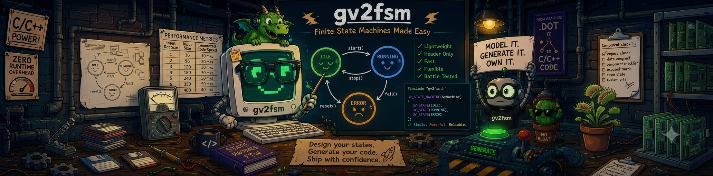
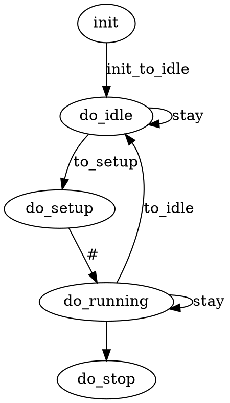
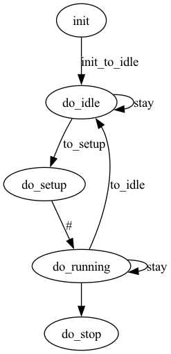

[](https://github.com/pbosetti/gv2fsm/actions/workflows/ci.yml)
[](https://github.com/pbosetti/gv2fsm/actions/workflows/release.yml)
[](LICENSE)
[](https://github.com/pbosetti/gv2fsm/releases/latest)



# gv2fsm — Graphviz to Finite State Machine generator

Draw your state machine as a [Graphviz](https://graphviz.org) `.dot` graph, run `gv2fsm` on it, and get ready-to-fill C or C++ scaffolding out the other end — headers, transition tables, and stub functions all wired together. No runtime dependency, no code to link against beyond what you write yourself.

This is the C++ successor to the original Ruby-based [gv_fsm](https://github.com/pbosetti/gv_fsm).

## Contents

- [Why gv2fsm](#why-gv2fsm)
- [Install](#install)
- [Quick start](#quick-start)
- [Writing the `.dot` file](#writing-the-dot-file)
- [Command-line reference](#command-line-reference)
- [C output](#c-output)
- [C++ output](#c-output-1)
- [Arduino support](#arduino-support)
- [SIGINT support](#sigint-support)
- [Updating generated files](#updating-generated-files)
- [Library usage](#library-usage)
- [Example](#example)
- [Development](#development)
- [License](#license)

## Why gv2fsm

- **One source of truth.** The state graph lives in a `.dot` file you can render and review with any Graphviz tool; the code is derived from it, not the other way around.
- **Two backends, one model.** Generate portable C or header-only C++17, from the same graph, with the same CLI.
- **Nothing to link.** C output is a plain `.h`/`.c` pair; C++ output is a header-only template class. Both compile with nothing but a standard toolchain.
- **Arduino-aware.** `--ino` swaps `syslog` for `Serial.print` and drops anything the Arduino toolchain can't use.
- **Safe to regenerate.** Once you've filled in the generated functions, `--update` re-runs the generator against a changed `.dot` file without clobbering your code — see [Updating generated files](#updating-generated-files).

## Install

### Pre-compiled binaries

Grab a package from the [latest release](https://github.com/pbosetti/gv2fsm/releases/latest) — macOS (universal), Linux (22.04+, x86_64/arm64), and Windows (x86_64) are provided.

### Build from source

```sh
cmake -Bbuild
cmake --build build
cmake --install build
```

This builds the `gv2fsm` executable together with static and shared libraries (`libgv2fsm.a` / `libgv2fsm.so`, or the platform equivalent). Requires CMake ≥ 3.16 and a C++20 compiler (Clang/AppleClang, GCC, or MSVC); all other dependencies (`cxxopts`, `inja`, `tree-sitter`) are fetched automatically via `FetchContent`.

To also build the test suite:

```sh
cmake -Bbuild -DGV2FSM_ENABLE_TESTS=ON
cmake --build build
ctest --test-dir build --output-on-failure
```

## Quick start

```sh
gv2fsm scheme.dot
```

generates `scheme.h` and `scheme.c` next to the `.dot` file. Fill in the state and transition function bodies in `scheme.c`, and drive the machine with `<prefix>run_state()` — see the example at the end of the generated source file.

Add `--cpp` for the C++ backend instead:

```sh
gv2fsm scheme.dot --cpp
```

which generates `scheme.hpp` (the class boilerplate — you typically won't touch it) and `scheme_impl.hpp` (the state/transition bodies you implement).

## Writing the `.dot` file

Use a **directed graph**. States are nodes, transitions are edges:

- A node's label (if given) becomes the name of its state function; otherwise it defaults to `do_<node-id>`.
- Every state function has the signature `state_t do_<name>(state_data_t *data)` (C) or `state_t do_<name>(T &data)` (C++, where `T` is `FiniteStateMachine<T>`'s state-data template parameter), and returns the next state.
- All persistent data goes in the `data` object — a `struct` in C, your own type in C++. In C, `state_data_t` is `typedef`'d as `void` by default: cast it in your functions, or edit the `typedef` in the generated header.
- An edge without a label generates no transition function. A labeled edge generates one named after the label; if the label is `#`, the name is auto-derived as `<source>_to_<dest>`.
- The graph must have **exactly one source state** (no incoming edges) and **zero or one sink state** (no outgoing edges) — `gv2fsm` validates this and reports the actual topology before generating anything.

## Command-line reference

```sh
gv2fsm scheme.dot [options]
```

| Option | Description |
|---|---|
| `-p, --project NAME` | Set the project name (also used as the C++ namespace) |
| `-d, --description TEXT` | Free-text description embedded in the generated header |
| `--cpp` | Generate C++17 sources instead of C |
| `-o, --output_file NAME` | Base name for the generated files (default: the `.dot` file's own base name) |
| `-e, --header-only` | Only (re)generate the header file |
| `-s, --source-only` | Only (re)generate the source file |
| `-x, --prefix PREFIX` | Prepend `PREFIX_` to every generated function, type, and object name |
| `-i, --ino` | Generate `.h`/`.cpp` sources tailored for Arduino (`Serial` instead of `syslog`, no SIGINT support) |
| `-l, --log` | Add `syslog` (or `Serial.print` under `--ino`) calls in state and transition functions |
| `-k, --sigint STATE` | Install a SIGINT handler that forces a transition to `STATE` — see [SIGINT support](#sigint-support) |
| `-f, --force` | Overwrite existing output files unconditionally |
| `-u, --update` | Update existing output, preserving hand-written code — see [Updating generated files](#updating-generated-files) |
| `-h, --help` | Print usage and exit |

Without `-f` or `-u`, `gv2fsm` refuses to overwrite a file that already exists.

## C output

`gv2fsm scheme.dot` produces:

- `scheme.h` — types, the state/transition-function tables, and declarations.
- `scheme.c` — the state and transition functions themselves, a generated prologue/epilogue around each (see below), and an example `main()`.

Each state function gets a small generated epilogue: a `switch` over the value your code returns, validating it against the states actually reachable from that node, and falling back to remaining in place if the returned state isn't a valid destination. The transition-function bodies are entirely yours.

## C++ output

Add `--cpp` to generate header-only C++17 instead. It's split across two files (`<name>` is your chosen output name):

- `<name>.hpp` — the `FiniteStateMachine` template class: transition tables, state-change validation, the `run()` loop. You normally never edit this file, and it's safe to fully regenerate whenever the graph's shape changes.
- `<name>_impl.hpp` — plain state and transition functions, implemented by you. Only `#include "<name>.hpp"` from your own code.

Compared to C:

- State and transition functions are bare functions — `FiniteStateMachine` does the state-change validation, so there's no generated `switch` inside your function body.
- An unimplemented state function returns `FSM::UNIMPLEMENTED`, which the class turns into an exception — an easy way to spot what's left to do.
- `FiniteStateMachine::run()` drives the machine until the sink state is reached (or forever, if the graph has none), optionally invoking a callback — a lambda or `std::function` — on every iteration, e.g. for logging.
- `FiniteStateMachine::set_timing_function()` registers a callback invoked once per iteration, for pacing or timing instrumentation.

## Arduino support

`--ino` generates a `.h`/`.cpp` pair with Arduino-specific bodies: `Serial.print`/`Serial.println` in place of `syslog`, and no SIGINT handling (`-k` is rejected together with `--ino`, since POSIX signals aren't available on that platform). Load the pair in the Arduino IDE, `#include` the header from your main `.ino` file, and call the state machine's driver function from `loop()`.

## SIGINT support

```sh
gv2fsm scheme.dot -k stop
```

installs a SIGINT handler in the FSM's source state (C) or once in `run()` (C++). Every *stable* state — one with a transition to itself — gains a check for a pending interrupt and transitions to the state named by `-k` (`stop` above) on the next iteration; the pending flag is the global `_exit_request` (C) or `<target-state>_requested` (C++). Non-stable states are unaffected. If the target state isn't a sink, `gv2fsm` still generates the code but warns that the machine may not actually terminate there. Incompatible with `--ino`.

## Updating generated files

Once you've filled in the generated state and transition functions (the `.c` file for C, `<name>_impl.hpp` for C++), editing the `.dot` file and regenerating would normally overwrite your work. `-u`/`--update` avoids that:

```sh
gv2fsm scheme.dot --cpp -u
```

Every generated state/transition function body — plus two file-level spots for extra `#include`s and helper code/globals — is wrapped in a marker comment pair:

```c
/* USER CODE BEGIN do_idle */
/* Your Code Here */
/* USER CODE END do_idle */
```

When `-u` is passed and the target file already exists:

- the file is regenerated from the (possibly changed) `.dot` graph, but the content of every `USER CODE BEGIN/END` region already on disk is copied into the matching region of the new file;
- new states or transitions get the usual default stub;
- states or transitions removed from the `.dot` file have their old code appended under an `/* ===== ORPHANED USER CODE ===== */` marker at the end of the file, so nothing is silently lost;
- the previous file is copied to `<file>.bak` first.

Without `-u` (or `-f`), `gv2fsm` still refuses to overwrite an existing output file.

**Files generated before this feature existed** have no markers yet. The first `-u` run on such a file falls back to a best-effort recovery: it parses the file with [tree-sitter](https://tree-sitter.github.io/tree-sitter/) and pulls each function's body out from around the generated boilerplate (the `switch` for C state functions, the final `return` for C++ state functions, or the whole body for transition functions). This is a one-time import — review the diff against the `.bak` copy afterwards; every following `-u` run then uses the markers it just wrote.

The same recovery also engages **per function** on files that otherwise have markers: if you delete or break an individual function's marker pair (removing one of the two lines, or mistyping its id), `-u` recovers that function's body structurally, scrubs any stray marker line, and writes it back inside a fresh pair. Whenever tree-sitter engages, `gv2fsm` prints a table of the recovered functions with the reason each one needed recovery:

```
Updated source scheme_impl.hpp (kept 12, added 0, orphaned 0)
  Some USER CODE markers were missing or broken: bodies recovered via tree-sitter (best effort, please review the diff against scheme_impl.hpp.bak):
    do_setup      marker pair missing
    do_running    marker pair malformed (stray line removed)
Backup saved to scheme_impl.hpp.bak
```

## Library usage

`gv2fsm` also ships as a library, so you can drive the same workflow from your own code instead of shelling out:

```cpp
#include <gv2fsm.hpp>

int main(int argc, char *argv[]) {
  return gv2fsm::run(argc, argv);
}
```

`gv2fsm::run(argc, argv, std::ostream &out, std::ostream &err)` is also available for capturing output instead of writing to `stdout`/`stderr`. The generator API additionally exposes `set_main_template(path)`, which loads an [inja](https://github.com/pantor/inja) template from a text file and substitutes it for the built-in example `main()` in generated source — pass an empty path to restore the default.

CMake consumers can link against the exported `Gv2Fsm::Gv2Fsm` target (static or shared, selected via `-DGV2FSM_STATIC_ONLY=ON` / `-DGV2FSM_SHARED_ONLY=ON`) after `find_package(Gv2Fsm)`.

## Example

[`examples/sm.dot`](examples/sm.dot):



renders as:



Here `stay` is generated once and shared by both self-loops (`idle`→`idle` and `running`→`running`), the `setup`→`running` transition's `#` label auto-generates `setup_to_running`, and `running`→`stop` has no label so no transition function is generated for it.

## Development

```sh
cmake -Bbuild -GNinja -DGV2FSM_ENABLE_TESTS=ON
cmake --build build
ctest --test-dir build --output-on-failure
```

The test suite (Catch2) covers the `.dot` parser, the FSM graph model, both generator backends (including C/C++ output parity), the `--update` merge engine, and end-to-end smoke tests that generate and compile real output. See [CHANGES.md](CHANGES.md) for the release history.

## License

Released under the [Apache License 2.0](LICENSE).
